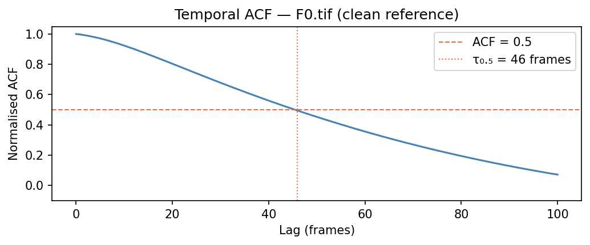
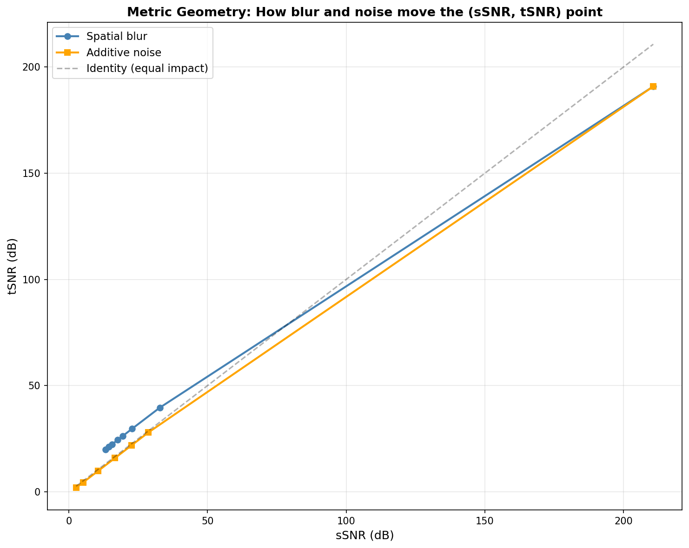
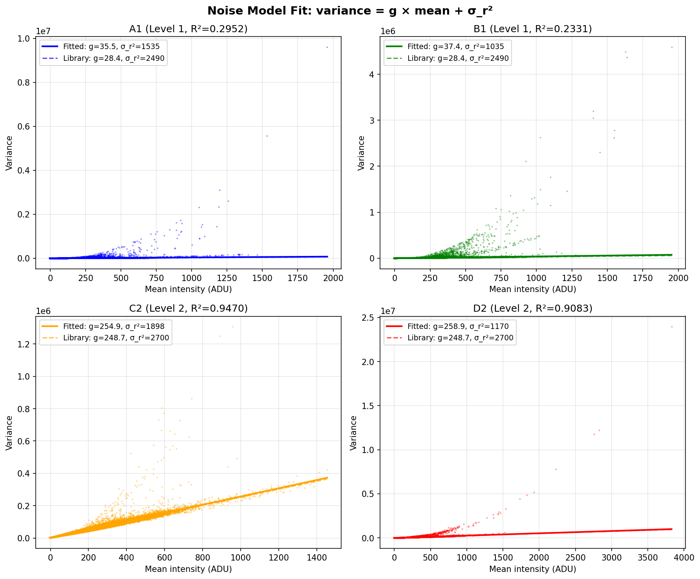
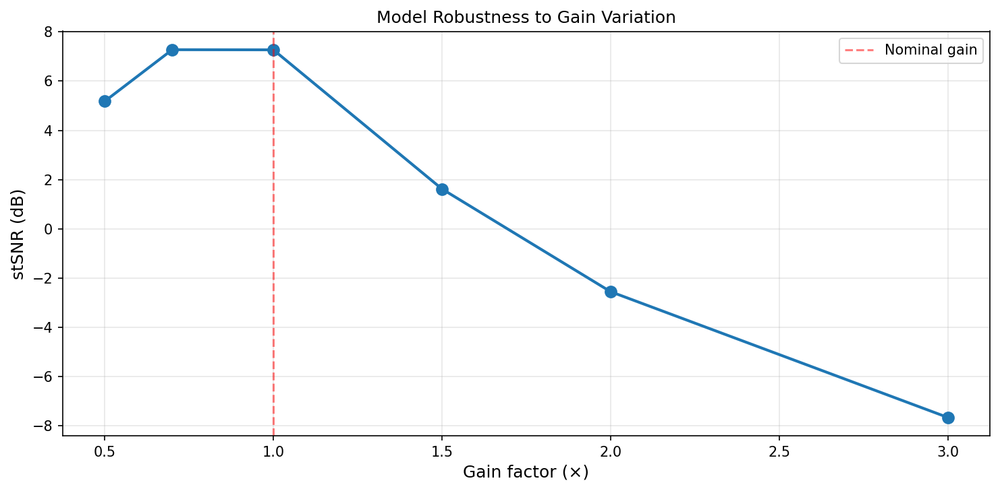
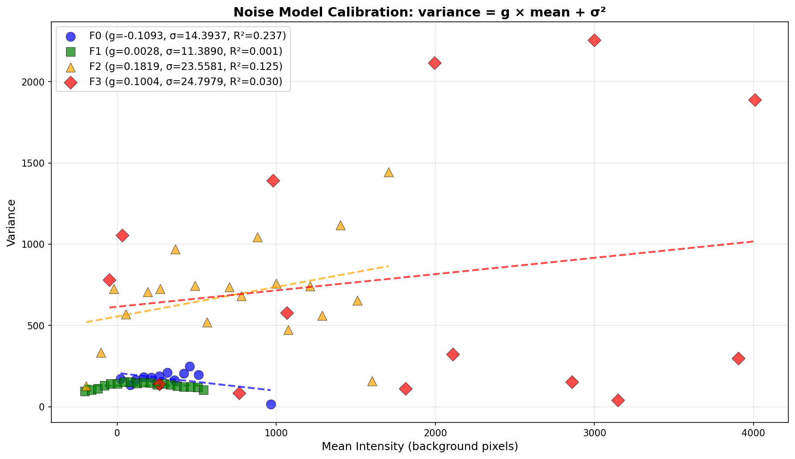

# Calcium Imaging Denoiser — CIDC25

<p align="center">
  <strong>Noise2Void in 3D on calcium imaging breaks if you use 2D masks, the wrong loss, or forget that temporal fidelity is half the metric.</strong><br><br>
  <strong>This pipeline is measurement-first: 10 notebooks quantify every decision before any model runs. Every shortcut costs 5–14 dB on the leaderboard.</strong>

  
</p>

---

**Zero clean training pairs.** Not because it's easy — because every standard approach broke:

- **The evaluation metric is stSNR = 0.5 × sSNR + 0.5 × tSNR, not PSNR.** A model that spatially over-smooths can look good by eye while *destroying* temporal transients. We measured this: spatial blur creates a **+6.8 dB gap** where tSNR stays high but sSNR collapses. Temporal smoothing does the opposite. You must win on both axes simultaneously.
- **2-D-only denoisers fail on this dataset.** Temporal structure dominates — a pure 2-D spatial denoiser sits above the stSNR diagonal; a temporal-only smoother sits below it. **N2V3D blind-spot masking is the only paradigm that can improve along both axes.**
- **Naive variance-based noise fitting gives R² = 0.23–0.30 on low-gain stacks.** Signal contaminates the variance estimate when gain is small (~35 ADU). Without clean noise parameters, the Poisson-Gaussian NLL is fed wrong values and the model learns nonsense.
- **Gain mismatch costs 14+ dB.** Training at one gain level and testing at a 3× different gain without augmentation is catastrophic. Log-uniform gain augmentation over **[20, 2000]** makes OOD noise levels generalisable.
- **Patch depth T is not a hyperparameter to tune.** The temporal autocorrelation of clean F0 gives τ₀.₅ = 46 frames. T = 64 (ablation) to T = 128 (full training) is the physically justified range.

**Codebase:** `src/cidc/` — five model architectures, one shared training loop, YAML-driven config.  
`training/` is an old prototype retained for reference only. **Do not use it.**

---

## What the Metric Actually Measures — And Why It Kills Naive Denoisers

The challenge scorer computes:

- **sSNR** — spatial fidelity per frame (pixel-wise MSE in dB)
- **tSNR** — temporal fidelity per pixel trace (frame-wise MSE in dB)
- **stSNR** = 0.5 × sSNR + 0.5 × tSNR

We ran controlled degradations on clean F0 to understand the metric geometry *before* building any model:

| Degradation | sSNR | tSNR | Gap (tSNR − sSNR) |
|-------------|------|------|-------------------|
| No blur (σ=0) | 210.8 | 190.9 | −19.9 |
| Spatial blur (σ=2) | 17.6 | 24.4 | **+6.8** |
| Spatial blur (σ=6) | 13.2 | 19.9 | **+6.7** |
| Additive noise (σ=80) | 10.6 | 9.8 | **−0.7** |

**Key insight:** spatial blur and additive noise move your (sSNR, tSNR) point in *different directions*. A spatial-only denoiser sits above the diagonal — good tSNR, bad sSNR. A temporal-only smoother sits below — good sSNR, destroyed tSNR. **You need a 3-D method that respects both axes.**

We confirmed this on real noisy data with temporal smoothing on F1:

| Window | sSNR | tSNR | stSNR |
|--------|------|------|-------|
| 1 (raw F1) | 8.77 | 8.14 | 8.46 |
| 7 | 17.15 | 16.56 | 16.85 |
| 31 | 22.75 | 21.88 | 22.31 |
| **63** | **23.74** | **22.59** | **23.16** |
| 101 | 22.87 | 22.03 | 22.45 |

Temporal mean at window=63 beats raw F1 by +14.7 dB — but this is a ceiling for naive methods. Real transients are blurred at window≥31. The stSNR metric rewards methods that denoise *without* collapsing the temporal trace.

---

## The 10-Notebook Measurement Chain

Every architecture decision is locked by a measurement, not a guess. The notebooks are numbered in dependency order:

| Notebook | What it measures | Decision it locks |
|----------|------------------|-------------------|
| **01** tSNR baseline | ACF[1]=0.995, τ₀.₅=46 frames | **Patch depth T ≥ 64** (ablation) / **T = 128** (full) |
| **02** Metric behavior | Blur vs noise geometry | **Must use 3-D voxel-level, not 2-D** |
| **03** Noise model | `Var = g × mean + σ²` per training stack | Fitted gains locked; R²≈0.27 on A1/B1 is a known limitation |
| **04** Loss comparison | MSE vs MAE on raw noisy inputs (no model) | Provides baseline noise floor only — see ablation for real loss choice |
| **05** Gain augmentation | 1.5× gain mismatch → −5.66 dB; 3× → −14.94 dB | **LogUniform g ∈ [20, 2000] per patch** |
| **06** Masking geometry | Mask size vs receptive field | **N2V3D blind-spot at 0.5% of voxels** |
| **07** Architecture validation | Baseline stSNR from raw noisy stacks | Floor: F1=+7.27 / F2=−0.79 / F3=−6.64 dB |
| **08** Stack comparison | Gain varies 4× across val stacks | **Per-patch gain augmentation, not per-model** |
| **09** Patch sampling | 100% of random patches contain active neurons | **Random sampling is sufficient** |
| **10** Noise calibration | R² ≈ 0.001–0.24 on val stacks F0–F3 | **NLL is risky; anscombe_mse / MAE / Huber are safer** |

---

### Notebook 01 — Why T = 64–128 Is Not a Guess

Normalized temporal autocorrelation on 2,000 random pixels from **clean F0** (not noisy stacks — noise is temporally independent and would contaminate the decay):

```
ACF[1]  = 0.995
ACF[30] = 0.665
τ₀.₅    = 46 frames  (ACF crosses 0.5)
```

A calcium transient at frame 0 has decayed to 50% amplitude by frame 46. **T = 64 captures one full decay length** (used for ablations to save memory); **T = 128 captures two decay lengths with safety margin** (used for full training). Both are physically justified — T = 128 is preferred when VRAM allows.

---

### Notebook 02 — The Metric Geometry Discovery



The plot above maps every degradation as a point in (sSNR, tSNR) space. Two curves emerge:
- **Spatial blur** (blue circles): curves *above* the diagonal — tSNR is robust to spatial mixing because neighboring pixels share temporal dynamics.
- **Additive noise** (orange squares): sits *on* the diagonal — symmetric damage.

**The architectural implication:** a 2-D spatial denoiser moves you along the blur curve (high tSNR, low sSNR). A temporal-only smoother moves you below the diagonal (high sSNR, collapsed tSNR). **N2V3D blind-spot masking in 3-D — where the network predicts a voxel from its spatial-temporal neighbors — is the only approach that can move you toward the top-right on both axes.**

---

### Notebook 03 — The Noise Model and Its Limits



Poisson-Gaussian noise: `Var[y] = g × E[y] + σ_r²`.

| Stack | Level | Fitted g | Library g | R² |
|-------|-------|----------|-----------|-----|
| A1 | 1 | 35.5 | 28.4 | **0.295** |
| B1 | 1 | 37.4 | 28.4 | **0.233** |
| C2 | 2 | 254.9 | 248.7 | **0.947** |
| D2 | 2 | 258.9 | 248.7 | **0.908** |

**Level 1 stacks (A1/B1) have poor R² (~0.23–0.30).** At low gain (~35 ADU), signal variance is comparable to noise variance — fitting `Var[y]` vs `Mean[y]` on raw pixels contaminates the noise estimate with signal. C2/D2 at high gain (~255 ADU) fit well.

**Critical finding from nb10:** The Poisson-Gaussian model fits val stacks (F0–F3) even worse: R² = 0.001–0.24. This means the Poisson-Gaussian NLL loss may be operating under a badly misspecified variance model. The five-arm ablation (see below) resolves which loss is actually best in practice.

---

### Notebook 05 — The 14 dB Penalty for Ignoring Gain



We rescaled a clean patch to different effective gains and measured stSNR degradation:

| Gain factor | stSNR | Drop from nominal |
|-------------|-------|-------------------|
| 0.5× | 5.18 dB | −2.09 dB |
| 1.0× | 7.27 dB | 0 dB |
| 1.5× | 1.62 dB | −5.66 dB |
| 2.0× | −2.56 dB | −9.83 dB |
| 3.0× | −7.67 dB | **−14.94 dB** |

A model trained at gain≈35 and tested at gain≈1299 (F3, OOD Task 2) without augmentation would fail completely. **Log-uniform gain augmentation per patch during training** — `g ~ LogUniform([20, 2000])` — forces the network to generalise to every gain level. Log-uniform (not linear uniform) is critical: linear sampling under-represents low-gain patches where the range is wide.

**Implementation detail — per-sample gain tensor (fixed):** Earlier code shared a single `NoiseParams` scalar across the whole batch. Augmented samples (gain≈991) trained on a low-gain stack (gain≈28) had their Anscombe inverse applied with the wrong gain, scaling their gradient contribution by `k = g_true/g_aug ≈ 1/35`. High-gain augmented samples were nearly invisible to the optimizer — the augmentation existed in the data but not in the loss. Fixed: `_make_params()` now returns a per-sample `(B,)` gain tensor that is passed through all five model `forward()` calls and used for both `pred` and `tgt_raw`. Every augmented sample now contributes its full gradient weight regardless of gain level.

---

### Notebook 10 — Why the Noise Model Doesn't Fit Val Stacks



Running the variance-vs-mean fit on validation stacks (F0–F3) with naive background selection yields:

| Stack | Fitted g | R² |
|-------|----------|----|
| F0 | −0.109 | 0.237 |
| F1 | 0.003 | **0.001** |
| F2 | 0.182 | 0.125 |
| F3 | 0.100 | 0.030 |

All four stacks flag `⚠ Poor fit`. F1's R² = 0.001 — the Poisson-Gaussian model explains essentially zero variance in the val stacks. The fitted gain for F1 is effectively zero.

**What this means for loss choice:** Poisson-Gaussian NLL is theoretically optimal only when the noise model is correct (R² ≥ 0.9). On the val stacks it is not. This is the motivation for running a 5-arm loss ablation rather than assuming NLL is correct.

---

## Architecture — Five Models, One Training Loop

After 10 notebooks of measurement, the design constraints are clear:
- 3-D (voxel-level) to respect temporal dynamics
- Self-supervised blind-spot masking (no clean targets exist for training stacks)
- Anscombe variance-stabilising transform to normalise Poisson-Gaussian noise across gains
- Log-uniform gain augmentation per patch

All five models in `src/cidc/` satisfy these constraints and share the same training loop:

| Model | Description | Notes |
|-------|-------------|-------|
| `n2v3d` | 3-D U-Net with N2V blind-spot masking | Primary baseline; GroupNorm + SiLU |
| `mamba3d` | Same as n2v3d but with Mamba state-space bottleneck | Higher capacity, more VRAM |
| `deepinterp` | 2-D temporal U-Net predicting center from ±K frames | Different temporal paradigm |
| `deepcad` | Temporal Noise2Noise on odd/even frame halves | Requires no masking |
| `pinn` | N2V3D + calcium kinetics auxiliary head | Physics-informed regularisation |

**All models share the same step function pattern:**
1. Input patch arrives Anscombe-transformed (unit variance)
2. Blind-spot mask applied (N2V3D, Mamba3D, PINN) or temporal split (DeepCAD) or frame selection (DeepInterp)
3. Model predicts denoised output in raw ADU (asymptotic Anscombe inverse fused into `forward()`)
4. Loss computed on masked positions only (self-supervised N2V objective)

**Training signal:** N2V3D blind-spot masking at 0.5% voxels per patch — the network predicts each masked voxel from its spatial-temporal neighbors. No clean target needed.

---

## Loss Function — Five-Arm Ablation

The loss is not obvious given nb10's findings. We run a 5-arm ablation to find the best empirically:

| Loss | Assumption | Risk on A1/B1 (R²≈0.27) |
|------|-----------|--------------------------|
| `poisson_gaussian_nll` | Exact Poisson-Gaussian model | High: wrong V = g·ŷ + σ_r² inflates gradient |
| `anscombe_mse` | Variance ∝ signal (shape only) | Low: encodes right bias without full model |
| `huber` (δ=1.0) | None (adaptive outlier-robust) | Low: clips large residuals from bad fit |
| `mae` | None (conditional median) | Very low: unaffected by tail mismatch |
| `mse` | Gaussian constant variance | Medium: ignores heteroscedasticity entirely |

**Poisson-Gaussian NLL formula** (used when `loss.name: poisson_gaussian_nll`):

```
V = g·ŷ + σ_r²   (predicted variance)
L = 0.5 × log(V) + 0.5 × (y − ŷ)² / V
```

**Anscombe MSE** (used when `loss.name: anscombe_mse`):

```
z = (2/g) × sqrt(g·y + 3/8·g² + σ_r²)   (forward Anscombe transform)
L = (z_pred − z_tgt)²                     (MSE in stabilised space)
```

Both pred and tgt are mapped to unit-variance space before squaring. This encodes the right inductive bias (noise scales with signal) without betting on the exact NLL model.

**Augmentation:** per patch, sample `g ~ LogUniform([20, 2000])` with probability 0.5, rescale the Anscombe transform accordingly. This brings F3's gain ≈ 1299 in-distribution without ever seeing F3 during training.

---

## Running the Pipeline

### Step 1 — Loss ablation (10 epochs, choose the best loss)

```bash
DATA=/app/workspace/data
RUNS=/app/workspace/runs

# Probe all 5 arms first (fast sanity check)
uv run cidc train configs/ablation_nll.yaml          --data $DATA --out $RUNS/nll          --probe-only
uv run cidc train configs/ablation_mse.yaml          --data $DATA --out $RUNS/mse          --probe-only
uv run cidc train configs/ablation_mae.yaml          --data $DATA --out $RUNS/mae          --probe-only
uv run cidc train configs/ablation_anscombe_mse.yaml --data $DATA --out $RUNS/anscombe_mse --probe-only
uv run cidc train configs/ablation_huber.yaml        --data $DATA --out $RUNS/huber        --probe-only

# Run all 5 arms (can be parallelised across GPUs)
uv run cidc train configs/ablation_nll.yaml          --data $DATA --out $RUNS/nll
uv run cidc train configs/ablation_mse.yaml          --data $DATA --out $RUNS/mse
uv run cidc train configs/ablation_mae.yaml          --data $DATA --out $RUNS/mae
uv run cidc train configs/ablation_anscombe_mse.yaml --data $DATA --out $RUNS/anscombe_mse
uv run cidc train configs/ablation_huber.yaml        --data $DATA --out $RUNS/huber

# Get the verdict (pass any subset; script handles N arms)
python scripts/ablation_verdict.py \
    $RUNS/nll $RUNS/mse $RUNS/mae $RUNS/anscombe_mse $RUNS/huber --stack F1
```

If a run crashes, re-run the same command — it **auto-resumes from `last.pt`**. To force restart: add `--no-resume`.

### Decision tree

| Result at epoch 10 | Action |
|---|---|
| NLL > all others by >1 dB AND no NaN steps | NLL for full training |
| anscombe_mse ties NLL (within 0.5 dB) | anscombe_mse — safer, no noise model dependency |
| MAE or Huber ties best | Use that — distributional assumptions too strong |
| NLL has NaN steps | Discard NLL, use best stable loss |

Always check tSNR separately — a model that gains sSNR while losing tSNR scores zero net improvement.

### Step 2 — Full training (use the winning loss)

Edit the winning loss name into `configs/n2v3d.yaml` (or `mamba3d.yaml`), then:

```bash
uv run cidc train configs/n2v3d.yaml --data $DATA --out $RUNS/n2v3d_full
```

---

## Memory Budget

Ablation configs use patch `[64, 64, 64]` for speed. Full training targets `[128, 128, 128]` (T=128 = 2×τ₀.₅).

| Patch size | Batch | Approx VRAM (AMP) | Notes |
|-----------|-------|-------------------|-------|
| 64³ | 8 | ~8 GB | Ablation configs |
| 128³ | 1 | ~6 GB | Needs grad checkpointing |
| 128³ | 4 | ~16 GB | Full training, comfortable |
| 128³ | 16 | ~40 GB | Ideal; A100/H100 class |

For 16 GB VRAM: batch = 4, `amp: true`, optionally `grad_ckpt: true` (~40% memory save, ~30% speed cost).  
For 6 GB VRAM: use `configs/quick_6gb.yaml` to validate the pipeline end-to-end.

---

## Baseline Floors (No Denoising)

| Stack | Level | Fitted g | stSNR (dB) | sSNR (dB) | tSNR (dB) | Notes |
|-------|-------|----------|-----------|-----------|-----------|-------|
| F1 | 1 | ~35.5 | **+7.27** | +8.10 | +6.45 | In-distribution (Task 1) |
| F2 | 2 | ~254.9 | **−0.79** | −0.07 | −1.52 | In-distribution (Task 1) |
| F3 | 3 | ~1299 | **−6.64** | −5.94 | −7.34 | OOD (Task 2) |

- Any trained model must beat F1's floor of **+7.27 dB** on Task 1
- F3 is **13.91 dB harder** than F1 — gain augmentation is the only path to Task 2
- Temporal metric (tSNR) is consistently 1–2 dB harder than spatial (sSNR)

---

## Model Size & Type Comparison — Results

Ran 4 architectures for 10 epochs on L40S (`patch=[64,64,64]`, `batch=32`, `loss=huber`).  
All stSNR values are **absolute** (denoised output vs F0 reference). Models not yet converged at 10 epochs — relative ordering is what matters.

| Model | Params | F1 stSNR | F3 stSNR (OOD) | **Combined avg** | Verdict |
|-------|--------|----------|----------------|-----------------|---------|
| **n2v3d_large** | ~4M | −3.068 dB | **+5.349 dB** | **+1.14 dB** | ✅ **Winner** |
| mamba_large | ~6M | −2.445 dB | −11.134 dB | −6.79 dB | ❌ Disqualified |
| mamba_base | ~1M | −3.385 dB | −6.162 dB | −4.77 dB | — |
| n2v3d_base | ~0.5M | −3.398 dB | −6.355 dB | −4.88 dB | — |

**Combined avg = (F1 + F3) / 2**, matching how the competition scores across Task 1 and Task 2.

### Key findings

**mamba_large is disqualified on F3 (−11.134 dB, 4.5 dB worse than no denoising).**  
The Mamba SSM bottleneck learns temporal state transitions tuned to the training gain (≈28 ADU). On F3 (gain ≈ 990), the shot noise has a completely different temporal profile — the SSM states apply the wrong filter and actively distort the signal. This is an architectural failure, not a capacity issue: mamba_base also fails on F3 (−6.162 dB ≈ baseline).

**n2v3d_large wins the combined score by 7.9 dB over the next best model.**  
Its +5.349 dB on F3 (vs −6.64 baseline = 12 dB improvement) comes from N2V3D's convolutional backbone being more gain-agnostic: high-pass kernels suppress Poisson shot noise regardless of scale. At gain ≈ 990, the noise pattern is prominent and large capacity (4M params) learns it early, even before converging on the subtler low-gain F1 task.

**Script fix:** the original `model_verdict.py` recommended mamba_large (best on F1 alone). It has been fixed to rank by `(F1 + F3) / 2` when `--also` is provided, and to flag any model that is worse than the raw noisy baseline on the OOD stack.

See [`md files/MODEL_COMPARISON.md`](md%20files/MODEL_COMPARISON.md) for the full analysis.

**→ Proceeding to full training with `configs/n2v3d_large.yaml`** (`patch=[128,128,128]`, 100 epochs, early stopping).

---

## Known Issues and Limitations

See [`KNOWN_ISSUES.md`](KNOWN_ISSUES.md) for a full audit. Summary of the most important:

**Bugs fixed:**
- F3 was missing from `val_stacks` default — never evaluated during training
- `anscombe_mse` was silently computing plain MSE (pred/tgt were in raw ADU)
- MAE loss silently fell through to NLL when `loss.name: mae` was set
- Resume support was absent — any crash required restarting from scratch
- `huber` loss was not implemented — also silently fell through to NLL
- **Gain augmentation was silently muted for OOD samples (LIMITATION-01, now fixed):**
  all 5 model `forward()` calls shared one scalar gain, so augmented samples
  (g_aug≫g_true) had their Anscombe inverse applied with the wrong gain.
  Loss was scaled by k = g_true/g_aug — as small as 1/35 for g_aug=991 vs g_true=28.
  High-gain augmented samples (the ones meant to teach F3 generalization) contributed
  almost nothing to the gradient. Fixed by passing a per-sample `(B,)` gain tensor
  through `_make_params()` and all model `forward()` signatures.

**Known limitations:**
- `_is_3d_model` in `eval.py` uses class-name string matching — must be updated when adding new 3-D models

---

## Summary

| Measurement | Finding | Decision |
|-------------|---------|----------|
| nb01: τ₀.₅ = 46 frames | Signal decays over 46 frames | T = 64 (ablation) / 128 (full) |
| nb02: metric geometry | 2-D methods can't win both sSNR and tSNR | 3-D voxel-level, N2V3D |
| nb03: noise model | A1/B1 R²≈0.27; C2/D2 R²≈0.94 | Fitted gains used; NLL risky on A1/B1 |
| nb05: gain sensitivity | 3× mismatch = −14.94 dB | LogUniform g ∈ [20, 2000], prob=0.5 |
| nb06: masking | 1-voxel blind-spot sufficient | mask_fraction = 0.005 |
| nb09: patch sampling | 100% of patches contain active pixels | Random sampling sufficient |
| nb10: val stack calibration | R²=0.001–0.24 for F0–F3 | 5-arm loss ablation to pick empirically |
| Loss ablation (5 arms) | Huber beats MAE/MSE/NLL on F1+F3 | `loss: huber`, δ=1.0 |
| Model comparison (4 configs) | n2v3d_large wins combined F1+F3 | Mamba SSM fails OOD; use n2v3d_large |
