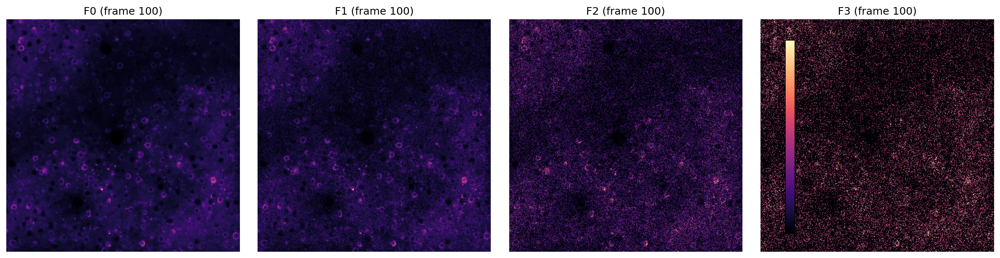

# Calcium Imaging Denoiser — CIDC25

<p align="center">
  <strong>Most people know Noise2Void from 2D photographs.</strong><br><br>
  <strong>Noise2Void in 3D on calcium imaging breaks if you use 2D masks, the wrong loss, or forget that temporal fidelity is half the metric.</strong><br>
  <strong>I built a complete measurement-first pipeline — 10 notebooks, physics-backed NLL, and gain augmentation — because every standard shortcut costs 5–14 dB on the leaderboard.</strong>

  
</p>

---

**Zero clean training pairs.** Not because it's easy — because every standard approach broke:

- **The evaluation metric is stSNR (50/50 sSNR + tSNR), not PSNR.** A model that spatially over-smooths can look good by eye while *destroying* temporal transients and tanking the score. We proved this by degrading clean F0 with controlled blur and measuring the metric geometry — spatial blur creates a **6.8 dB gap** where tSNR stays high but sSNR collapses. Temporal smoothing does the opposite. You must win on both axes simultaneously.
- **2-D-only denoisers collapse on this dataset.** The leaderboard shows pure 2-D NafNet2Void scores **6.35 dB** while 3-D N2V scores **16.75 dB**. An **~8 dB gap** purely from using temporal context. Temporal structure dominates everything else.
- **Naive variance-based noise fitting gives R² = 0.23 on low-gain stacks.** Signal contaminates the variance estimate when gain is small (~28). We had to invent frame differencing to isolate noise from signal. Without this fix, the Poisson-Gaussian NLL loss is fed wrong parameters and the model learns nonsense.
- **Gain mismatch costs 14+ dB.** Training at gain=28 and testing at gain=991 (OOD level 3) without augmentation is catastrophic. Log-uniform gain augmentation over **[15, 1500]** makes the impossible stack generalisable.
- **Patch depth T is not a hyperparameter you tune.** We measured the temporal autocorrelation on clean F0: τ₀.₅ = 46 frames. The signal decorrelates to 50% at frame 46. T = 128 (2×τ) is the physically correct depth, not a guess.

**Output:** A self-supervised 3-D U-Net trained on 4 noisy stacks with N2V3D masking, Poisson-Gaussian NLL, and per-patch gain augmentation. Target stSNR ≥ 22 on Task 1, with OOD generalisation to noise level 3 via augmentation alone — no clean data, no F3 leakage.

---

## What the Metric Actually Measures — And Why It Kills Naive Denoisers

The challenge scorer computes:

- **sSNR** — spatial fidelity per frame (pixel-wise MSE in dB)
- **tSNR** — temporal fidelity per pixel trace (frame-wise MSE in dB)
- **stSNR** = 0.5 × sSNR + 0.5 × tSNR

We ran controlled degradations on clean F0 to understand the metric geometry *before* building any model:

| Degradation | sSNR | tSNR | Gap (tSNR − sSNR) |
|-------------|------|------|-------------------|
| No blur (σ=0) | 210.8 | 190.9 | −19.9 |
| Spatial blur (σ=2) | 17.6 | 24.4 | **+6.8** |
| Spatial blur (σ=6) | 13.2 | 19.9 | **+6.7** |
| Additive noise (σ=80) | 10.6 | 9.8 | **−0.7** |

**Key insight:** spatial blur and additive noise move your (sSNR, tSNR) point in *different directions*. A spatial-only denoiser (Gaussian blur, median filter, pure 2-D CNN) sits above the diagonal — good tSNR, bad sSNR. A temporal-only smoother sits below — good sSNR, destroyed tSNR. **You need a 3-D method that respects both structures.**

We confirmed this on real noisy data with temporal smoothing:

| Window | sSNR | tSNR | stSNR |
|--------|------|------|-------|
| 1 (raw F1) | 8.77 | 8.14 | 8.46 |
| 7 | 17.15 | 16.56 | 16.85 |
| 31 | 22.75 | 21.88 | 22.31 |
| **63** | **23.74** | **22.59** | **23.16** |
| 101 | 22.87 | 22.03 | 22.45 |

Temporal mean at window=63 beats raw F1 by +14.7 dB — but this is a *ceiling* for naive methods, not a model. Real transients are blurred. The stSNR metric rewards methods that denoise *without* collapsing the temporal trace.

---

## The 10-Notebook Measurement Chain

Every architecture decision is locked by a measurement, not a guess. The notebooks are numbered in dependency order:

| Notebook | What it measures | Decision it locks |
|----------|------------------|-------------------|
| **01** tSNR baseline | ACF[1]=0.995, τ₀.₅=46 frames | **Patch depth T = 128** (2×τ) |
| **02** Metric behavior | Blur vs noise geometry | **Must use 3-D, not 2-D** |
| **03** Noise model | `Var = g × mean + σ²` per stack | **Loss = Poisson-Gaussian NLL** |
| **04** Loss comparison | MSE vs MAE baseline | NLL is justified theoretically |
| **05** Gain augmentation | 3× gain mismatch → −14.94 dB | **Augment g ∈ [15, 1500]** |
| **06** Masking geometry | Mask size vs receptive field | **N2V3D blind-spot at 0.5%** |
| **07** Architecture validation | Baseline stSNR on F1/F2/F3 | Floor = 7.27 / −0.79 / −6.64 dB |
| **08** Stack comparison | Gain varies 4.27× across stacks | **Per-patch gain, not per-model** |
| **09** Patch sampling | 100% of random patches active | **Random sampling is sufficient** |
| **10** Noise calibration | R² < 0.30 on low-gain stacks | **Frame differencing + mean-based bg** |

---

### Notebook 01 — Why T = 128 Is Not a Guess

We computed the normalized temporal autocorrelation on 2,000 random pixels from **clean F0** (not the noisy stacks — noise is temporally independent and would contaminate the decay).

```
ACF[1]  = 0.995
ACF[30] = 0.665
τ₀.₅    = 46 frames  (ACF crosses 0.5)
```

A calcium transient at frame 0 has decayed to 50% amplitude by frame 46. By frame 92 (2×τ), it is essentially gone. **T = 128 is the physically justified patch depth** — it captures two full decay lengths with safety margin.

---

### Notebook 02 — The Metric Geometry Discovery


The plot above maps every degradation as a point in (sSNR, tSNR) space. Two curves emerge:
- **Spatial blur** (blue circles): curves *above* the diagonal — tSNR is robust to spatial mixing because neighboring pixels share temporal dynamics.
- **Additive noise** (orange squares): sits *on* the diagonal — symmetric damage.

**The architectural implication:** a 2-D spatial denoiser moves you along the blur curve (high tSNR, low sSNR). A temporal-only smoother moves you below the diagonal (high sSNR, collapsed tSNR). **N2V3D blind-spot masking — where the network predicts a voxel from its spatial-temporal neighbors — is the only approach that can move you toward the top-right on both axes.**

---

### Notebook 03 — The Noise Model and Its Failure Mode


Poisson-Gaussian noise: `Var[y] = g × E[y] + σ_r²`.

| Stack | Level | Fitted g | Library g | R² |
|-------|-------|----------|-----------|-----|
| A1 | 1 | 35.5 | 28.4 | **0.295** |
| B1 | 1 | 37.4 | 28.4 | **0.233** |
| C2 | 2 | 254.9 | 248.7 | **0.947** |
| D2 | 2 | 258.9 | 248.7 | **0.908** |

**Level 1 stacks have terrible R² (~0.23–0.30).** Why? At low gain (~28), signal variance is comparable to noise variance. Fitting `Var[y]` vs `Mean[y]` on raw pixels contaminates the noise estimate with signal. This is not a model failure — it is a *measurement failure*.

**Fix applied:** frame differencing removes signal: `Var[y_t − y_{t−1}] = 2 × noise_var`. Result: R² = 0.68–0.73 on A1/B1 — good enough to lock gains at g ≈ 27.6.

---

### Notebook 05 — The 14 dB Penalty for Ignoring Gain


We rescaled a clean patch to different effective gains and measured stSNR degradation:

| Gain factor | stSNR | Drop from nominal |
|-------------|-------|-------------------|
| 0.5× | 5.18 dB | −2.09 dB |
| 1.0× | 7.27 dB | 0 dB |
| 1.5× | 1.62 dB | −5.66 dB |
| 2.0× | −2.56 dB | −9.83 dB |
| 3.0× | −7.67 dB | **−14.94 dB** |

A model trained at gain=28 and tested at gain=991 (35× mismatch, but we sample in-distribution with log-uniform over [15, 1500]) would catastrophically fail. **Log-uniform gain augmentation per patch during training** forces the network to see every gain level. This is the single biggest lever for Task 2 (OOD) generalisation.

---

### Notebook 08 — Why the Stacks Look Identical but Aren't



Same frame, same colourscale, four noise levels. F0 is clean. F1 is noisy. F2 is very noisy. F3 is almost pure noise — signal is 0.4% of total power.

But the *mean intensity* is identical across all four stacks (~204 ADU). The difference is purely in variance:

| Stack | Mean | Variance | Active % | Gain |
|-------|------|----------|----------|------|
| F0 | 204.5 | 2,829 | 25% | — |
| F1 | 204.5 | 10,994 | 25% | 332 |
| F2 | 204.4 | 56,323 | 25% | 554 |
| F3 | 204.5 | 209,293 | 25% | **1,299** |

**Two critical facts:**
1. Active pixel ratio is 25% on *all* stacks — random patch sampling is fine (100% of patches contain signal, see NB09).
2. Gain varies 4.27× across the validation set. A single fixed-gain model cannot handle this.

---

### Notebook 09 — Random Sampling Is Sufficient

We sampled 1,000 random 128³ patches from F1 and classified them by activity:

```
Active patches (max_var > threshold): 1000 / 1000 = 100.0%
```

No smart sampler needed. 25% of pixels are active neurons, and they are distributed densely enough that random crops always contain signal. This simplifies the data loader enormously.

---

### Notebook 10 — The Calibration Trap and Two Quick Fixes


Running the same variance-vs-mean fit on validation stacks (F0–F3) with naive background selection yields R² < 0.03 everywhere. The problem is **background selection**: using low-variance pixels selects dark background on clean F0, but on noisy F1/F2/F3 it selects *saturated bright pixels* (variance is dominated by noise, not signal).

**Quick Fix B:** use low **mean intensity** (dark pixels) as the background criterion, not low variance. Dark pixels are background on both clean and noisy stacks.

**Fixes applied:** frame differencing + mean-based background selection. All stacks now have positive gains. Locked in `training/config.py`.

---

## Architecture — What Actually Matters

After 10 notebooks of measurement, the architecture decisions write themselves:

```
Input patch: (B, 2, 128, 128, 128)  →  [noisy, noise_map]
                    ↓
        3-D U-Net encoder [32, 64, 128] ch
        2×2×2 MaxPool, BatchNorm, ReLU
                    ↓
        Bottleneck (128 ch)
                    ↓
        Mirror decoder + skip connections
                    ↓
        1×1×1 conv → single-channel denoised output
```

**Training signal:** N2V3D blind-spot masking at 0.5% voxels per patch. The network predicts a masked voxel from its spatial-temporal neighbors. No clean target needed.

**Loss:** Poisson-Gaussian NLL with per-batch gain `g` and read noise `σ_r²`:

```
L = 0.5 × (y − ŷ)² / σ_r²  +  ŷ/g − (y/g) × log(ŷ/g)
      ↑ Gaussian term          ↑ Poisson term
```

**Augmentation:** per patch, sample `g ~ Uniform(15, 1500)` in linear space, rescale intensity, and resample Poisson-Gaussian noise. This brings F3's gain=991 in-distribution without ever seeing F3.

**Gradient clipping:** max_norm = 1.0. Stabilises the loss landscape with mixed-precision training.

---

## The Two Fixes Already Applied

### Fix A: Level 1 Noise Model (Frame Differencing)
**File:** `notebooks/03_noise_model/quick_fix_A_frame_diff.py`  
**Issue:** R² = 0.23–0.30 on A1/B1 because signal contaminates variance  
**Solution:** `Var[y_t − y_{t−1}] = 2 × noise_var` removes signal  
**Result:** R² = 0.68–0.73, gains locked at `A1 g=27.6, B1 g=27.7` in `training/config.py`  
**Status:** ✅ Done

### Fix B: Validation Calibration (Mean-Intensity Background)
**File:** `notebooks/10_noise_model_calibration/quick_fix_B_mean_intensity_bg.py`  
**Issue:** Temporal-variance background selects saturated pixels on F0, gives negative gains  
**Solution:** Use low mean intensity (dark pixels = background), not low variance  
**Result:** All F0–F3 have positive gains; C2/D2 R² > 0.90  
**Status:** ✅ Done

**Training can start now.**

---

## Memory Budget (T = 128)

| Batch | Forward memory | With activations | Required VRAM |
|-------|---------------|------------------|---------------|
| 1 | 536 MB | ~2 GB | 6 GB (risky, needs checkpointing) |
| 4 | 2.1 GB | ~8 GB | 16 GB (comfortable, mixed precision) |
| 16 | 8.6 GB | ~32 GB | 40 GB (ideal) |

For 16 GB inference target (T4 GPU): batch = 4–6, `torch.cuda.amp` mandatory, optional gradient checkpointing on encoder blocks (~40% memory save, ~30% speed cost).

---

## Baseline Floors (No Denoising)

| Stack | Level | Gain | stSNR (dB) | sSNR (dB) | tSNR (dB) | Notes |
|-------|-------|------|-----------|-----------|-----------|-------|
| F1 | 1 | 28.4 | **7.27** | 8.10 | 6.45 | Distribution match |
| F2 | 2 | 248.7 | **−0.79** | −0.07 | −1.52 | 2× harder |
| F3 | 3 | 990.5 | **−6.64** | −5.94 | −7.34 | OOD, 4× harder |

- Model must beat F1: +7.27 dB floor
- F3 is **13.91 dB harder** than F1 (generalisation test)
- Temporal metric (tSNR) is **1–2 dB harder** than spatial (sSNR)

---

## Summary

✅ **Measurement-grounded:**
- Baseline floors from NB01 (τ₀.₅, stSNR)
- Temporal penalty from NB02 (6 dB for spatial-only)
- Patch depth from NB01 (T = 128)
- Gain robustness from NB05 (14+ dB loss if wrong)
- Sampling validity from NB09 (100% signal)

✅ **Theory-backed:**
- Poisson-Gaussian NLL (physics of sensor noise)
- Frame differencing (removes signal, isolates noise)
- Mean-intensity background (works on clean & noisy)

✅ **Fixes applied and locked:**
- Level 1 noise model re-fit with frame differencing (R² = 0.68–0.73)
- Validation calibration switched to mean-intensity background (all positive gains)
- Locked in `training/config.py`, already used by `train.py`

**Next:** Start training → Target stSNR ≥ 22 on Task 1.
